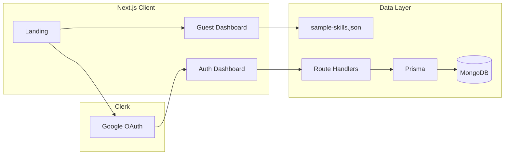

# Skills Learning Tracker — Phased Build Plan

Build Skills Learning Tracker in phases: **static Next.js UI** with pnpm, shadcn/ui, and brand-kit tokens first, then **Clerk (Google) + Prisma/MongoDB**, then wire CRUD, guest mode, polish, and deploy.

## Progress

| Phase | Status |
|-------|--------|
| 0 — Scaffold | Done |
| 1 — Design system + Landing | Done |
| 2 — App shell + static dashboard | Done |
| 3 — Domain logic + mock store CRUD | Done |
| 4 — Skill detail + dark mode | Done |
| 5 — Clerk (Google) | Done |
| 6 — Prisma + MongoDB + API | Done |
| 7 — Wire UI ↔ backend + guest | Done |
| 8 — Animations + polish | Done |
| 9 — Deploy + README | Pending |

---

## Locked decisions

| Choice | Decision |
|--------|----------|
| Package manager | **pnpm** (not npm/yarn) — all install/run scripts use `pnpm` |
| Stack | Next.js (App Router) + Tailwind v4 + **shadcn/ui** + **Zustand** + Prisma + MongoDB + Clerk (Google OAuth only) |
| UI library | **shadcn/ui** — primitives in `@/components/ui`; add via `pnpm dlx shadcn@latest add <component>`; product UI on top of Dialog, Button, Input, etc. |
| Client state | **Zustand** — stores in `src/store/` for client-side skills/sessions and UI state; no second global state library |
| Styling | Map [`starter/tokens.css`](../starter/tokens.css) / [`guidance/brand-kit.md`](../guidance/brand-kit.md) into shadcn CSS variables + Tailwind theme; fonts Space Grotesk + Inter |
| Agent rules | Tech stack in [`.cursor/rules/project.mdc`](../.cursor/rules/project.mdc) (`alwaysApply: true`) |
| Dashboard | Bento grid; **featured skill = most recently practiced**; progress rings for skills with goals, hours-first for no-goal; overall streak + heatmap prominent; recent sessions (5) on dashboard |
| Session log UX | Primary CTA / FAB on dashboard → shadcn Dialog; duration presets (15/30/45/60) + flexible parse; notes collapsed by default; optimistic update + brief success moment |
| Differentiator | **Animated Progress & Micro-Interactions** (Phase 8) |
| Stretch in scope | Dark mode, Skill Detail view, error/empty/loading + performance; **Session Timer deferred** |
| Auth UX | Landing CTAs: **Continue with Google** + **Try as Guest** (no email/password — Clerk Google only) |

---

## Architecture (target)

**Static phases** use in-memory / module state seeded from [`data/sample-skills.json`](../data/sample-skills.json). **Backend phases** replace that with Prisma repositories behind the same UI contracts so components barely change.

---

## Phase 0 — Scaffold

**Status:** Done

- Create Next.js App Router app with **pnpm** in repo root; keep `spec/` / `guidance/` as local AI reference.
- Init **shadcn/ui** for Tailwind v4; base color / CSS vars aligned to brand emerald.
- Merge brand tokens into app theme CSS (`src/app/globals.css`); fonts: Space Grotesk + Inter.
- Folder layout under `src/`: `app/`, `components/ui`, `components/`, `lib/`, `types/`, `store/`, `hooks/`.
- Env template: `.env.example` with `MONGODB_URI`, `CLERK_*`.
- Create [`.cursor/rules/project.mdc`](../.cursor/rules/project.mdc) documenting the locked tech stack.

**Exit:** `pnpm dev` shows a blank shell with shadcn + brand tokens; `project.mdc` exists.

---

## Phase 1 — Design system + Landing (static)

**Status:** Done

Compose UI from **shadcn** + brand kit + [`guidance/patterns.md`](../guidance/patterns.md):

- Add shadcn pieces as needed: `button`, `input`, `dialog`, `label`, `textarea`, `select`, `dropdown-menu`, `skeleton`, `tooltip`, `sonner` (or toast), `alert-dialog`, `sheet` if needed for mobile log.
- Product components (not duplicating shadcn): EmptyState, SkillColorDot, ProgressRing (SVG), StreakBadge, HeatmapCell.
- Landing page ([`core-requirements.md`](../spec/core-requirements.md) §7): hero value prop, 3–4 feature highlights, dual CTAs (Google + Guest — Guest → `/dashboard` or `/guest`; Google → Clerk when ready).
- Visual showcase using rings/heatmap mock.

**Exit:** Responsive landing that matches brand mood; CTAs navigate somewhere.

---

## Phase 2 — Static app shell + Dashboard layout

**Status:** Done

- App chrome: minimal top bar (logo, theme placeholder, avatar placeholder).
- Routes: `/dashboard`, `/skills`, `/skills/[id]` stub.
- Bento dashboard with sample-derived props: featured skill, skill cards, overall stats, Practice Activity heatmap, recent sessions (5), Log session entry point.
- Responsive stacking per Core §5 (44px touch targets).

**Exit:** Dashboard looks like a product with sample numbers; no real mutations yet.

---

## Phase 3 — Static domain logic + interactive mock state

**Status:** Done

Implement pure functions in `lib/` (unit-testable, no DB):

- Duration parse: `"45"`, `"1h 30m"`, `"1.5"` → minutes; validate min 1, warn > 8h.
- Streaks: current / longest per skill + overall; **at-risk** if no practice today but yesterday had practice; timezone = local calendar date (`YYYY-MM-DD`).
- Heatmap: aggregate minutes/day; intensity levels from brand kit thresholds; filter by skill; day detail on tap.
- Goal progress: weekly vs total hours.

Wire **Zustand** store seeded from [`data/sample-skills.json`](../data/sample-skills.json) (shift dates relative to today — see [`data/README.md`](../data/README.md)):

- Skill CRUD UI (create/edit/delete with confirm).
- Session log modal (full UX), edit/delete session.
- Dashboard recomputes from store immediately after log.

**Exit:** Full Core UX walkthrough works offline on mock data. Static frontend milestone.

---

## Phase 4 — Skill Detail + Dark mode (still static)

**Status:** Done

- `/skills/[id]`: stats, filtered heatmap, session history, goal pace, edit skill.
- Dark mode: `prefers-color-scheme` + toggle; persist in `localStorage` for now; use dark tokens from brand kit.
- Empty/loading skeletons for all major views.

**Exit:** Stretch Skill Detail + Dark Mode working on mock store.

---

## Phase 5 — Clerk (Google only)

**Status:** Done

- Add `@clerk/nextjs`; middleware protect `/dashboard`, `/skills/*` for signed-in users **except** explicit guest path.
- Clerk dashboard: enable **Google** only; disable email/password if possible.
- Landing: “Continue with Google” → Clerk; post-sign-in → `/dashboard`.
- Sync strategy: on first authenticated request, upsert `User` by `clerkId` (Phase 6).
- Signed-in chrome: Clerk user button / sign out.

**Exit:** Google sign-in works; protected routes redirect; guest still uses mock path.

---

## Phase 6 — Prisma + MongoDB schema + API

**Status:** Done

Prisma MongoDB models (aligned with [`spec/technical-requirements.md`](../spec/technical-requirements.md)):

- `User`: `clerkId` (unique), preferences (theme, etc.)
- `Skill`: `userId`, name, color, goal type/target, timestamps
- `Session`: `skillId`, `userId`, `durationMinutes`, `date` (string `YYYY-MM-DD`), notes, timestamps
- Indexes: user+date, user+skill, user+skill+date

Route Handlers (or Server Actions):

- Skills CRUD, Sessions CRUD
- Summary endpoint for dashboard (avoid loading all history for summary)
- Cascade delete: deleting skill deletes its sessions

**Exit:** API works with a test user id; Mongo has data.

---

## Phase 7 — Integrate UI ↔ backend

**Status:** Done

- Replace mock store for **authenticated** users with API / Server Actions.
- Keep the same `lib/` calculators; feed them API data.
- Optimistic session create with rollback on error (Core stretch §13).
- Theme preference: write to DB preferences when signed in.
- Guest mode (**Core §8**): `/guest` or session flag — load sample JSON into **session-scoped** client store only; no Prisma writes; gentle “Sign in with Google to save” prompts.
- Date-shift guest sample data on load so streaks look current.

**Exit:** Guest explores demo; Google user gets persistent personal data; dashboard updates after log.

---

## Phase 8 — Differentiator + polish

**Status:** Done

- Animated rings (value → value), streak count-up, heatmap staggered fade-in, log confirmation micro-moment; honor `prefers-reduced-motion`.
- Error toasts, network failure states, delete confirms.
- Performance pass: skeletons, avoid layout shift, heatmap ≤12 months without jank.
- Accessibility baseline from [`guidance/accessibility.md`](../guidance/accessibility.md).
- **Language:** English + Vietnamese via `next-intl` (`/en/…`, `/vi/…`), browser detection on first visit, switcher in TopBar / landing.

**Exit:** Feels polished; differentiator visible on guest demo.

---

## Phase 9 — Deploy + README

**Status:** Pending

- Host on Vercel; Atlas MongoDB; Clerk + env vars; HTTPS.
- Smoke test: incognito guest URL (submission tip: guest experience URL).
- Fill [`README-template.md`](../README-template.md): stack, design decisions (dashboard + log UX), schema notes, Lighthouse scores.

**Exit:** Live URL + documented solution.

---

## Suggested build order vs Core checklist

| Core feature | First appears |
|--------------|---------------|
| Landing | Phase 1 |
| Responsive shell / dashboard layout | Phase 2 |
| Skills + Sessions + streaks + heatmap (logic) | Phase 3 |
| Auth | Phase 5 |
| Persistence | Phase 6–7 |
| Guest | Phase 7 |
| Skill detail / dark / a11y-perf | Phase 4 + 8 |
| Animations differentiator | Phase 8 |

---

## AI collaboration notes

- Point the agent at `AGENTS.md`, [`.cursor/rules/project.mdc`](../.cursor/rules/project.mdc), this plan, the relevant `spec/*.md`, and `guidance/brand-kit.md` + `patterns.md`.
- Always use **pnpm** and **shadcn** per `project.mdc` — never npm or hand-rolled Button/Dialog duplicates.
- One phase (or one Core section) per prompt; paste acceptance criteria.
- Do not let the agent redesign dashboard/log UX without the locked decisions above.
- After Phase 3, treat UI as frozen contracts; backend only swaps data source.

## Related docs

| File | Role |
|------|------|
| [`AGENTS.md`](../AGENTS.md) | AI collaboration context |
| [`spec/`](../spec/) | Product + requirements |
| [`guidance/`](../guidance/) | Brand, patterns, a11y |
| [`.cursor/rules/project.mdc`](../.cursor/rules/project.mdc) | Locked tech stack |
